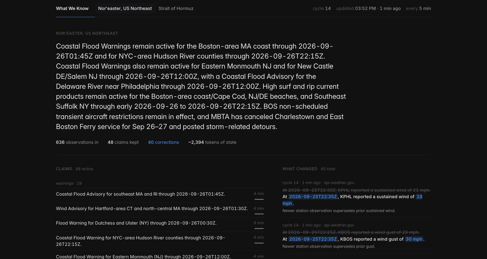
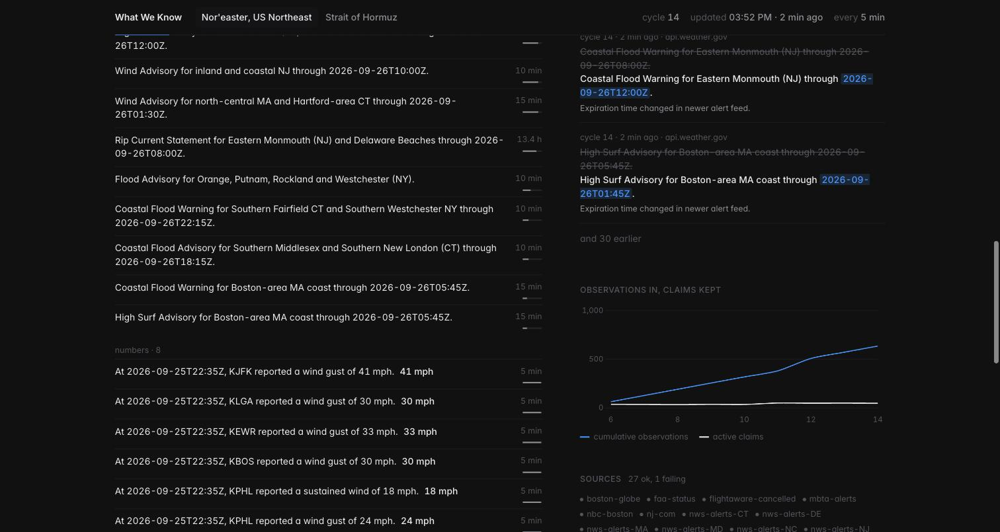
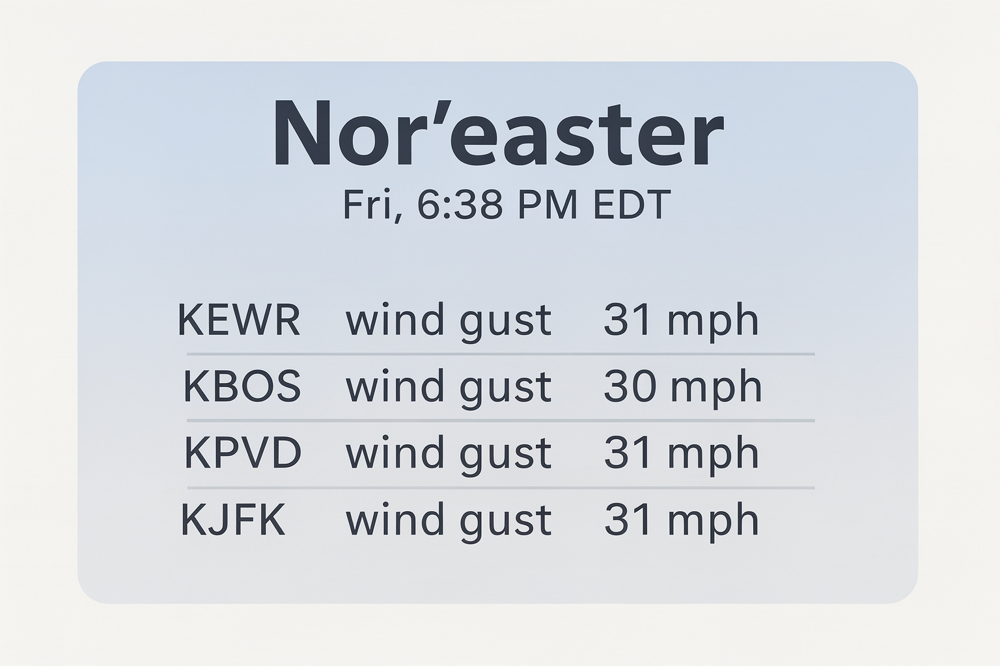

# What We Know

An agent that follows a developing news story for hours, keeps **one small "what we know" ledger** instead of a growing transcript, and corrects itself when sources disagree.

Built at the Long Horizon Agents Hackathon (tokens& · AWS Builder Loft, San Francisco, 25 Sep 2026).





The dashboard is one HTML file: hero summary, a diff of what changed with only the changed tokens in color, dense claims grouped by type with confidence as a hairline, one accent line on the chart, and a one-line footer of who did what. Press 1 or 2 to switch stories.

## The idea

Long-horizon agents rot: observations, actions and stale context pile up until the history slows them down, costs more and makes their own state unreliable. This agent never keeps history. Every five minutes it:

1. reads a ~1,500-token JSON ledger (claims with confidence, TTL and sources; open questions; source health),
2. fetches fresh evidence from the live web,
3. rewrites the ledger from scratch, superseding, retracting or reconfirming claims,
4. throws every raw page away.

The next cycle sees only the ledger. Observations climb into the thousands; the ledger stays flat. That chart is on the dashboard.

Two stories run from the same code with one config file each: the nor'easter hitting the US Northeast today (`stories/noreaster.json`) and the Strait of Hormuz proposal (`stories/hormuz.json`).

## Architecture

```
every 5 min ──> PLAN ──> ACT ──> OBSERVE ──> SELF-CORRECT ──> PERSIST ──> RENDER ──> HEAL
                 │        │         │             │              │           │         │
             ledger    Nimble    Liquid         OpenAI        RawTree      FLUX     tickets
             (RawTree) + fixed   small model    big model     (all        (on       (Broccoli
                        sources  triage         merge          events)     major     or file)
                                                                          change)
                                       Bedrock writes the plain-language summary
```

| Step | What happens | Who does it |
|---|---|---|
| PLAN | Load latest ledger from RawTree (fallback: `state/<story>.json`). Build 3 to 6 queries: latest, open questions, stale claims. | `src/plan.ts` |
| ACT | Nimble search with full content + every fixed source (NWS alerts and observations, FAA NAS status XML, MBTA alerts, Nimble page extract). 20 s timeout each, failures counted, never fatal. | `src/act/` |
| OBSERVE | Heuristic splitter keeps sentences with numbers, times, places or keywords (max 40 per doc, 300 per cycle). The Liquid small model labels each snippet `new`, `duplicate:cN`, `contradicts:cN` or `irrelevant`, seeing only the compact claim list and one snippet. | `src/observe/` |
| SELF-CORRECT | One OpenAI structured-output call: current ledger + surviving snippets + merge rules -> full new ledger + corrections. Bedrock rewrites the summary from active claims. | `src/correct/` |
| PERSIST | Every observation, triage label, ledger version, correction, token count and source health row goes to RawTree. Raw text is discarded. | `src/persist/` |
| RENDER | On a major change (warning changed, headline number moved > 20 %, claim retracted) FLUX draws a situation card. Max one per 15 min. | `src/render/flux.ts` |
| HEAL | A source that fails 3 times gets a fix ticket (`tickets/<story>-<source>.md` + RawTree + Broccoli if configured) and is polled only every 6th cycle. | `src/heal/tickets.ts` |

Invariants: at most 60 active claims; superseded/retracted claims leave the ledger 30 min after their status changed (they live on in RawTree); cycle number = last ledger cycle + 1, so a crashed cycle is simply redone; no raw page text ever enters the ledger, a later prompt, or git; every model call logs tokens, model and milliseconds; a per-cycle token budget (`MAX_TOKENS_PER_CYCLE`, default 60,000) skips remaining snippets when exceeded.

## Sponsor tools

| Sponsor | Used for | Where |
|---|---|---|
| **Nimble** | `search` with `full_content: true` for planned queries; `extract.run` (rendered) for pages without an API (PowerOutage.us, FlightAware, local news, Reuters, AP...). Concurrency 4, retries, 429 backoff. | `src/act/nimble.ts` |
| **Tinybird RawTree** (optional) | Event store. Plain HTTP inserts into `observations`, `triage`, `ledger_versions`, `corrections`, `tokens`, `source_health`, `cards`, `tickets`, `cycles`; read-only SQL for state loading, the dashboard and `demo-stats`. The same rows are always appended to a local JSONL store under `state/events/<story>/`, which the dashboard and `demo-stats` use when `RAWTREE_API_KEY` is not set. | `src/persist/` |
| **Liquid AI** | LFM2.5 triage model (`liquid/lfm-2.5-2.6b` on OpenRouter; nothing runs locally). It labels the highest-weight snippets of each cycle (`LIQUID_MAX_PER_CYCLE`, default 40); the rest go to an OpenAI mini model. OpenRouter's Liquid endpoint forces a reasoning phase that cannot be disabled, so the call gets a 1,500-token budget and, if the model runs out while thinking, the label is read from the tail of its reasoning. Every triage row logs which model answered. | `src/observe/triage.ts` |
| **OpenAI** | The merge model: one structured-output call per cycle producing the whole new ledger plus corrections, retried once with the validation error on schema failure. | `src/correct/merge.ts` |
| **AWS** | Bedrock Converse rewrites the summary from active claims. `Dockerfile` + `deploy/ec2.md` run the loop on EC2. | `src/correct/summary.ts` |
| **Black Forest Labs** | FLUX situation card on major changes. | `src/render/flux.ts` |
| **Broccoli** | Fix tickets are the hand-off point for a coding agent to repair a broken parser. If `BROCCOLI_API_URL`/`BROCCOLI_API_KEY` are set the ticket is POSTed there; otherwise the markdown file is the ticket. | `src/heal/tickets.ts` |

Live counts for each of these are on the dashboard's "Who did what" strip and in `npm run demo-stats`.

## Numbers from the live run (25 Sep 2026, 15:41 PT, `npm run demo-stats`)

Nor'easter story, loop running since 15:07 PT on this laptop (earlier cycles before RawTree was configured are not counted):

| | |
|---|---|
| cycles | 7 persisted (12 total), median 161 s |
| observations fetched | 445 (425 ok) |
| snippets triaged | 976: 117 by Liquid `lfm-2.5-2.6b`, 696 by OpenAI mini, 163 by the mini fallback while Liquid was rate-limited |
| active claims now | 56 (75 in the ledger incl. recently superseded) |
| corrections | 54, e.g. "KBOS gust 30 mph at 21:40Z" superseded by "32 mph at 22:05Z"; a coastal flood advisory's end time moved from 12:00Z to 08:00Z |
| merges by OpenAI | 7 (`gpt-5.2`), one structured-output call per cycle |
| ledger size | median ~2,500 tokens in the compact form the model reads (target was 1,500; see below) |
| sources | 28 healthy, 1 ticket written today (`tickets/noreaster-nbc-boston.md`) |
| cards by FLUX | 2 (`docs/card-noreaster.jpg`) |

Hormuz story, same code, `stories/hormuz.json`: 2 cycles, 68 observations, 600 snippets triaged (39 by Liquid), 19 active claims, ledger ~1,050 tokens.



Honest notes: the nor'easter ledger sits above the 1,500-token target because the model keeps one claim per NWS product per area (56 active claims); the cap of 60 active claims holds and superseded claims are pruned after 30 minutes. Bedrock summaries are implemented but were not exercised (no AWS credentials on the day; OpenAI wrote the summaries, and the dashboard says so). Broccoli was not configured, so tickets are files plus RawTree rows.

## Run it

```bash
npm install
cp .env.example .env      # fill in keys; every integration degrades gracefully if its key is missing
npm run check-env         # one real call per sponsor, pass/fail table
npm run cycle             # one cycle of the nor'easter story
npm run loop              # every 5 minutes, forever
npm run loop:hormuz       # second story, second process
npm run dashboard         # http://localhost:3000
npm run demo-stats        # headline numbers for the pitch
npm run dry               # fixtures only, no network, stub models (writes under noreaster-dry)
npm run sandbox           # reads the real ledger, writes under noreaster-sandbox, never advances the main ledger
```

Status line per cycle:

```
cycle 37 | obs 48 (46 ok) | snippets 212 | triage new 9 contradict 2 dup 140 irr 61 | claims 41 active | corrections 1 | tokens 18,400 | ledger ~1210 tok | 41 s
```

### Kill and restart

```bash
npm run loop        # ... cycle 12 | ...
^C                  # finishes the current cycle, releases state/noreaster.lock
npm run loop        # [..] cycle 13 | noreaster | ledger from rawtree (cycle 12, 41 active)
```

The loop resumes at cycle N+1 from the last ledger version in RawTree, or from `state/noreaster.json` (written every cycle) when RawTree is not configured. Nothing to clean up. Real lines from today's log (`state/loop-noreaster.log`), the loop was killed and restarted several times while features were added:

```
    [22:09:48] stopped after 1 cycles
    [22:09:54] cycle 7 | noreaster | ledger from cache (cycle 6, 37 active) | 6 queries
```

## Ledger schema

See `src/types.ts`. A claim is `{id, text, type, value, unit, confidence, status, sources, first_seen, last_confirmed, ttl_minutes, supersedes}`; `type` is one of `warning | number | event | forecast | statement`, `status` one of `active | superseded | retracted`. Default TTLs: number 30 min, warning 60, event 180, forecast 120, statement 240 (story configs can override).

## Ledger size

The model reads the ledger in a compact one-line-per-claim form (`ledgerForPrompt`) and writes it back as full JSON. The "ledger tokens" number in the status line and on the dashboard is the compact form, i.e. what the next cycle actually pays for. The stored JSON is roughly three times larger because of field overhead; it is never sent to a model.

## Notes on APIs (fixes to the original spec)

- Nimble `extract.run` is synchronous in `@nimble-way/nimble-js` 1.5 and returns `data.markdown` directly; no task id polling is needed (`extract.async` is the polled variant).
- RawTree API keys are created per database and already carry the database scope, so `RAWTREE_DATABASE` is optional. If set, it is sent both as the `?database=` query parameter (what the official SDK and MCP server send) and as an `x-rawtree-database` header.
- RawTree returns `DateTime64` values as `2026-09-25 22:07:55.852000000`; the dashboard API normalises them to ISO before the browser sees them.
- The FLUX endpoint is `POST https://api.bfl.ai/v1/flux-2-pro`; the client falls back to `flux-pro-1.1` on 404.
- Local Liquid models were dropped on purpose: the default `lfm2.5` tag on Ollama is an 8B model (5 GB) and froze an 8 GB laptop when loaded next to the loop, Cursor and a browser. Triage never uses a local endpoint now; `TRIAGE_BASE_URL` pointing at localhost is ignored with a warning.
- The FAA NAS status feed has no ground stops today for the Northeast; it reports JFK and LGA ground delay programs (reason: wind) and a BOS NOTAM closure to non-scheduled transient aircraft, all of which parse as separate lines.

## Repo layout

```
stories/            one JSON config per story
src/cycle.ts        one cycle end to end
src/run.ts          loop, lock file, SIGINT, status line
src/act/            Nimble client + fixed source parsers (NWS, FAA, MBTA, generic page)
src/observe/        snippet splitter + Liquid triage
src/correct/        OpenAI merge, Bedrock summary, prompts
src/persist/        RawTree HTTP client + ledger state
src/render/         FLUX card
src/heal/           fix tickets
src/dashboard/      Hono API + single HTML page (Chart.js)
scripts/            check-env, demo-stats, save-fixtures
fixtures/           saved public API responses for --dry-run
tickets/            generated fix tickets (committed; they are part of the story)
```

## Team

Solo entry.

- **Henri Mäkivirta** — Co-founder, Memo Technologies
- SILTA accelerator (F26 cohort)
- Email: henri.makivirta@gmail.com
- GitHub: [@henrihjm](https://github.com/henrihjm)
- X: [@TODO_X_HANDLE](https://x.com/TODO_X_HANDLE)
- LinkedIn: [henrimakivirta](https://www.linkedin.com/in/henrimakivirta/)
